# Breast-Cancer-scRNAseq-Analysis
Breast Cancer scRNA-Seq Map (100k Cells)Analyzed GSE176078 biopsy using Seurat v5. Ran QC, log-norm, PCA, UMAP, and Wilcoxon tests to map 36 Louvain clusters into 9 annotated cell types (Tumor, T/B, Myeloid, CAF). single-patient scope. Full reproducible R code + plots available.

# Decoding the Breast Tumor Microenvironment with Single-Cell RNA-seq

End-to-end single-cell RNA-seq analysis of human breast cancer tissue, taking raw 10x Genomics count data through quality control, normalization, dimensionality reduction, unsupervised clustering, and marker-gene-validated cell type annotation.

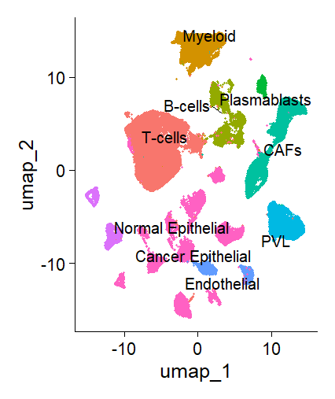

## Overview

| | |
|---|---|
| **Dataset** | Wu et al. 2021, *Nature Genetics* — [GSE176078](https://www.ncbi.nlm.nih.gov/geo/query/acc.cgi?acc=GSE176078) |
| **Platform** | 10x Genomics Chromium (droplet-based scRNA-seq) |
| **Raw cells** | 100,064 |
| **Cells after QC** | 98,593 |
| **Genes measured** | 27,719 |
| **Highly variable genes used** | 2,000 |
| **Principal components retained** | 30 |
| **Unsupervised clusters** | 36 |
| **Final annotated cell types** | 9 |
| **Tools** | R 4.5, Seurat v5, dplyr, ggplot2, presto |

## Pipeline

```
Raw counts (.mtx)
      │
      ▼
Quality control (nFeature_RNA, nCount_RNA, percent.mt)
      │
      ▼
Log-normalization (LogNormalize, scale factor 10,000)
      │
      ▼
Feature selection (top 2,000 highly variable genes, vst method)
      │
      ▼
Scaling + regression of technical covariates (nCount_RNA, percent.mt)
      │
      ▼
PCA (50 PCs computed, 30 retained via elbow method)
      │
      ▼
UMAP projection (2D visualization)
      │
      ▼
Louvain graph-based clustering (resolution = 0.5) → 36 clusters
      │
      ▼
Marker gene identification (Wilcoxon rank-sum test)
      │
      ▼
Cell type annotation (marker-validated) → 9 populations
```

## Results

### Quality control

Cells were filtered on three standard metrics before any downstream analysis: number of detected genes (`nFeature_RNA`), total transcript count (`nCount_RNA`), and mitochondrial read fraction (`percent.mt`).

**Filter applied:** `200 < nFeature_RNA < 6000` and `percent.mt < 20` → **98,593 / 100,064 cells retained**

| Before filtering | Threshold relationships |
|---|---|
| 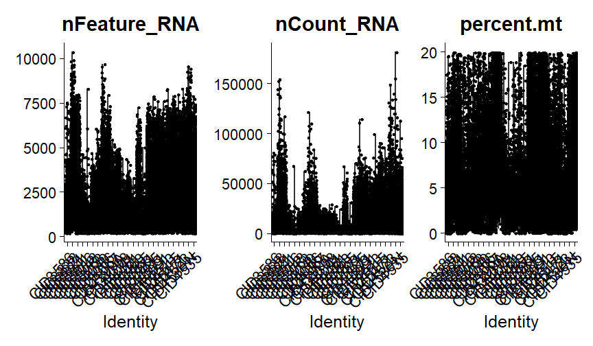 | 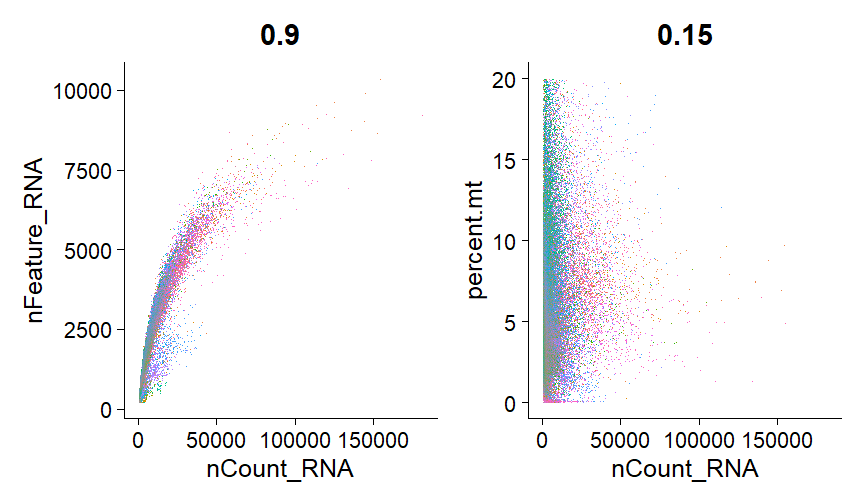 |

### Feature selection

2,000 of 27,719 genes were retained as highly variable. Immunoglobulin variable-region genes (IGKV/IGHV/IGLV) dominate the variance ranking — an early signal of substantial B-cell / plasma cell infiltration in this tumor.

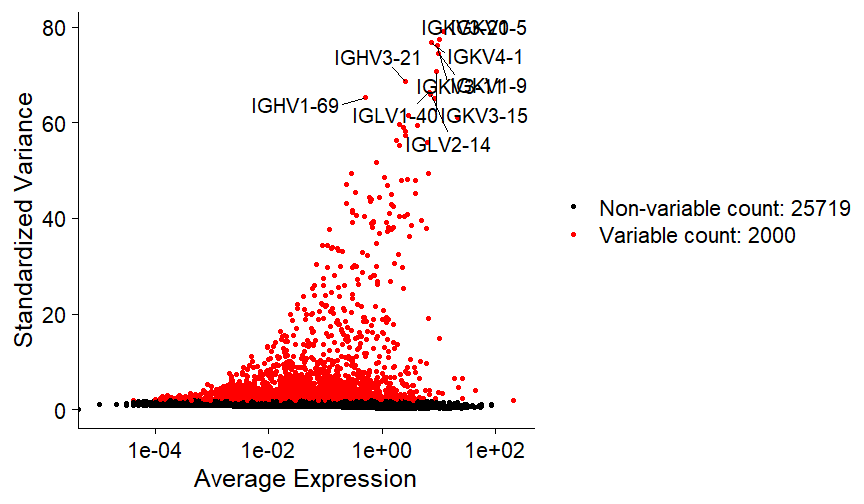

### Dimensionality reduction

PCA on the scaled HVG matrix; 30 PCs retained based on the elbow-plot inflection point.

| PCA embedding | Elbow plot |
|---|---|
| 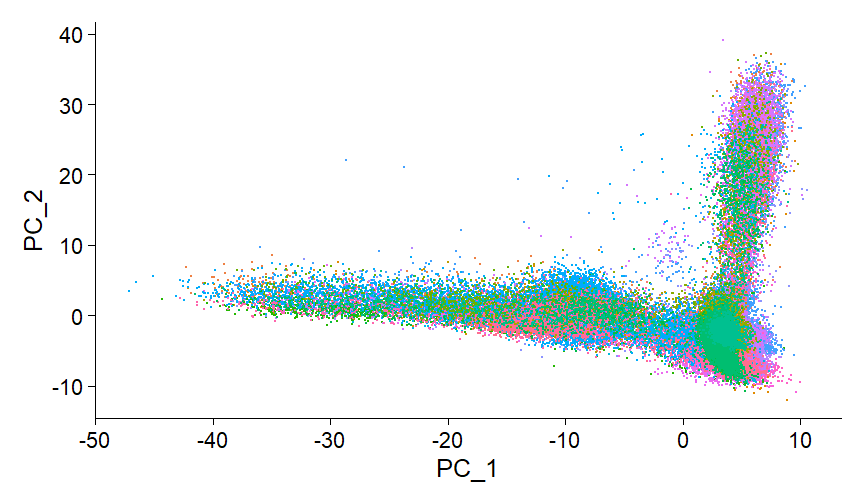 | 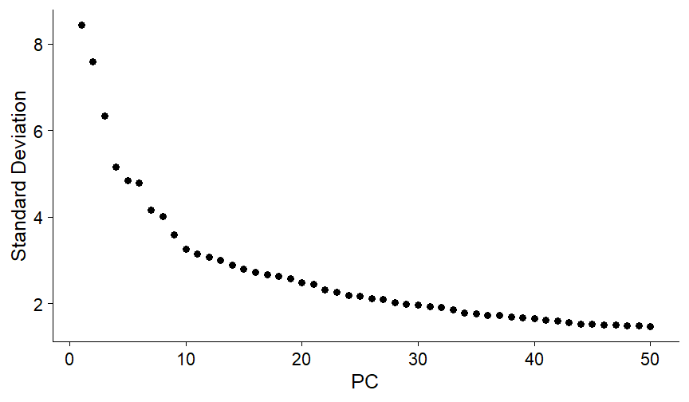 |

Each PC corresponds to an interpretable gene signature even before clustering — e.g. PC1/PC2 separate a stromal collagen signature (`COL1A1`, `COL1A2`) from a myeloid/complement signature (`C1QA`, `C1QB`); PC3 isolates an endothelial signature (`PECAM1`, `VWF`, `CDH5`).

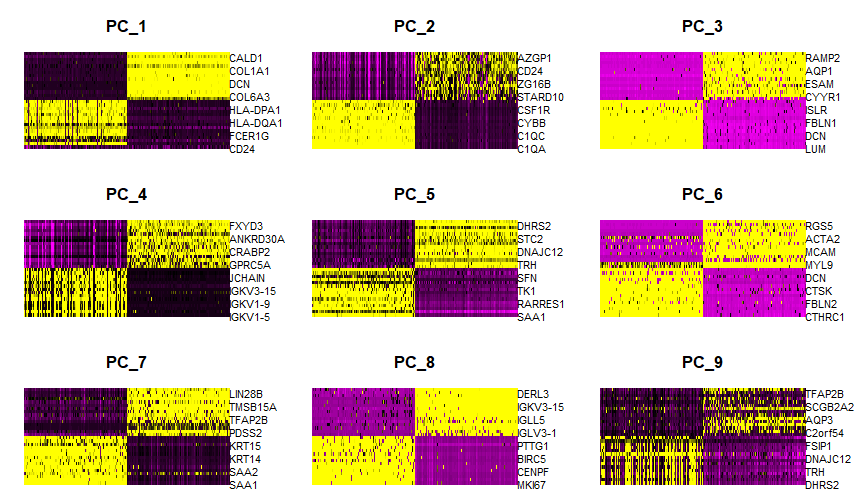

### Clustering

Graph-based Louvain clustering on the 30-PC space produced 36 unsupervised clusters (resolution = 0.5, modularity = 0.9575).

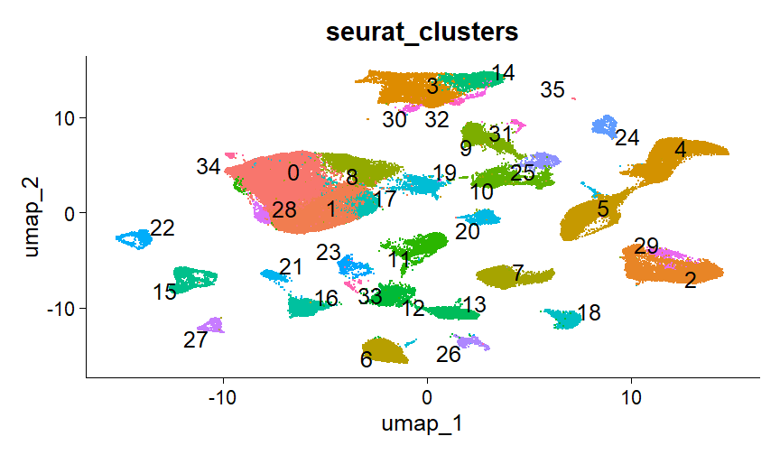

### Marker validation

Canonical marker genes were projected onto the UMAP embedding to validate that cluster boundaries correspond to real cell-type biology.

| Epithelial / tumor markers (EPCAM, KRT8, KRT18) |
|---|
| 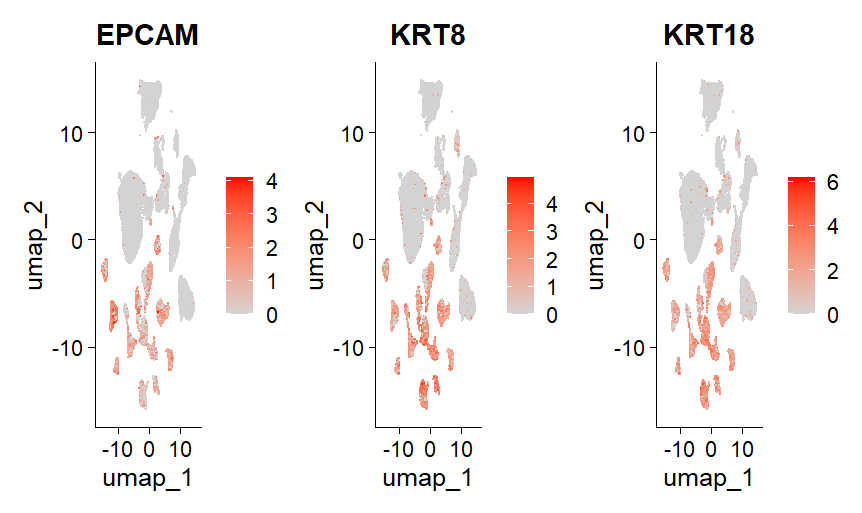 |

| Immune markers (CD3D, CD79A, CD68, GNLY) | Stromal markers (COL1A1, PECAM1, ACTA2) |
|---|---|
| 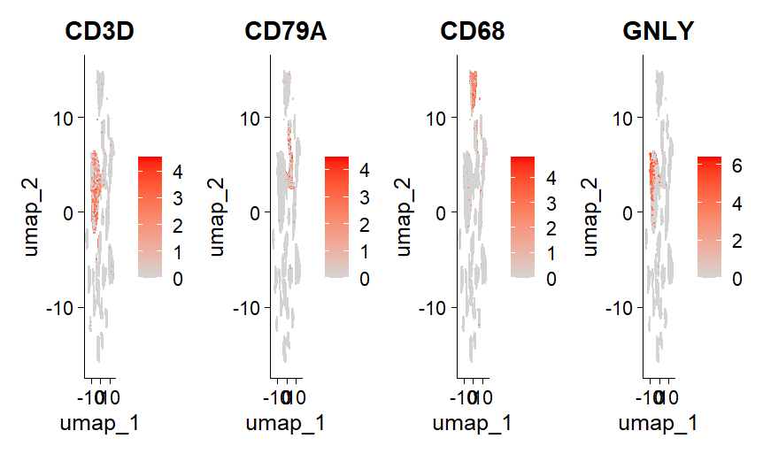 | 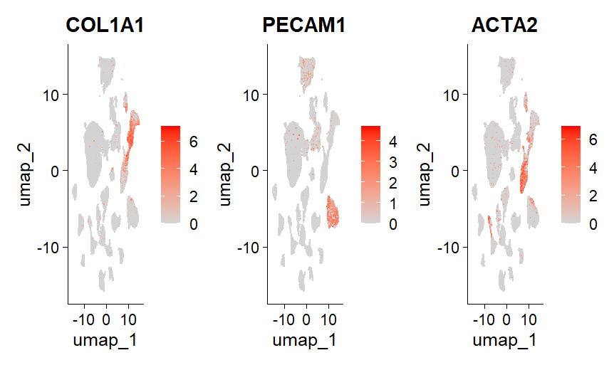 |

### Cell type annotation

The 36 clusters were consolidated into 9 biologically distinct populations of the breast tumor microenvironment:

- T-cells
- Myeloid (macrophages / monocytes)
- B-cells
- Plasmablasts
- Cancer-associated fibroblasts (CAFs)
- Perivascular-like cells (PVL)
- Endothelial cells
- Normal epithelial cells
- Cancer epithelial cells

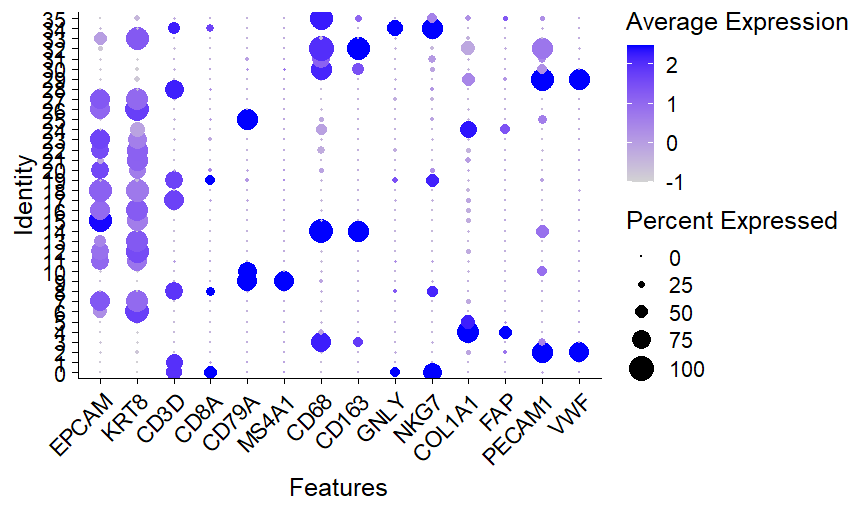

## Known limitations

This project was deliberately scoped for a complete, reproducible run on a single machine, which involved two explicit trade-offs:

1. **No doublet removal.** `DoubletFinder` was not run. At ~100,000 cells it requires constructing artificial doublets and re-running PCA/UMAP internally, which roughly doubles memory and compute requirements — impractical on standard hardware at this scale. This is a documented scope decision, not an oversight.
2. **Single patient sample.** This analysis covers one of the 26 patients in the full Wu et al. cohort. Multi-patient integration would require batch-effect correction (e.g. Harmony or Seurat's CCA) before clustering, which was out of scope for this iteration.

## Repository structure

```
.
├── scripts/
│   └── 01_scRNAseq_breast_cancer_analysis.R   # full annotated analysis pipeline
├── figures/                                    # all output plots referenced above
├── results/                                     # marker gene tables, saved Seurat object
└── docs/
```

## Reproducing this analysis

```r
# Requirements
install.packages(c("Seurat", "Matrix", "ggplot2", "dplyr"))
devtools::install_github("immunogenomics/presto")

# Run
source("scripts/01_scRNAseq_breast_cancer_analysis.R")
```

Expect the full pipeline to take 30–60 minutes and require approximately 16 GB of available RAM at this cell count.

## Reference

Wu, S.Z., Al-Eryani, G., Roden, D.L. *et al.* A single-cell and spatially resolved atlas of human breast cancers. *Nat Genet* **53**, 1334–1347 (2021). https://doi.org/10.1038/s41588-021-00911-1

Su, M., Pan, T., Chen, Q.Z. *et al.* Data analysis guidelines for single-cell RNA-seq in biomedical studies and clinical applications. *Mil Med Res* **9**, 68 (2022). https://doi.org/10.1186/s40779-022-00434-8

## License

Analysis code: MIT License. Underlying data is subject to the original GEO submission's terms (GSE176078).

